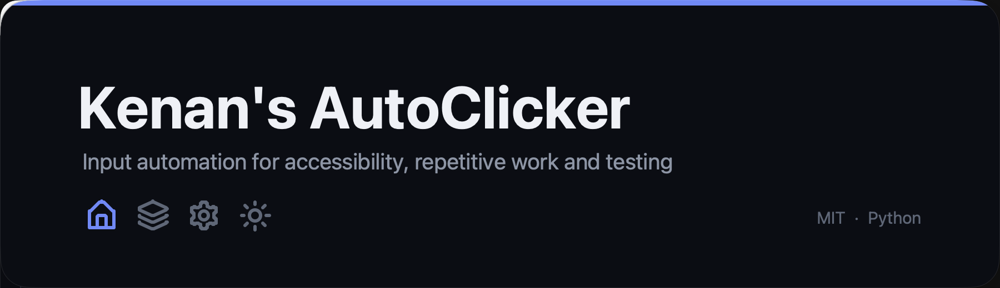
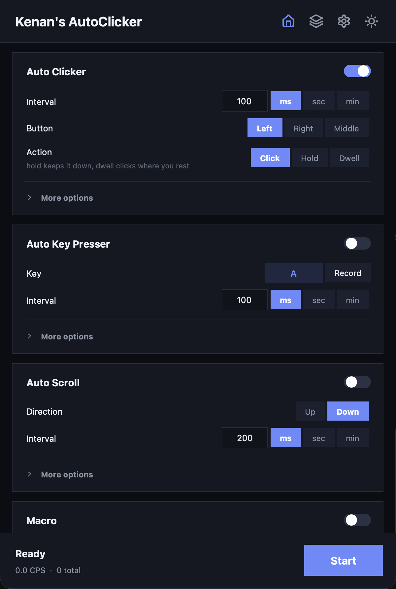
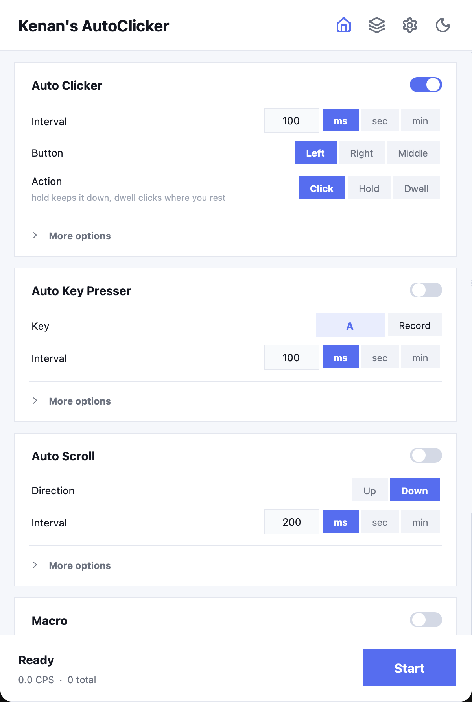
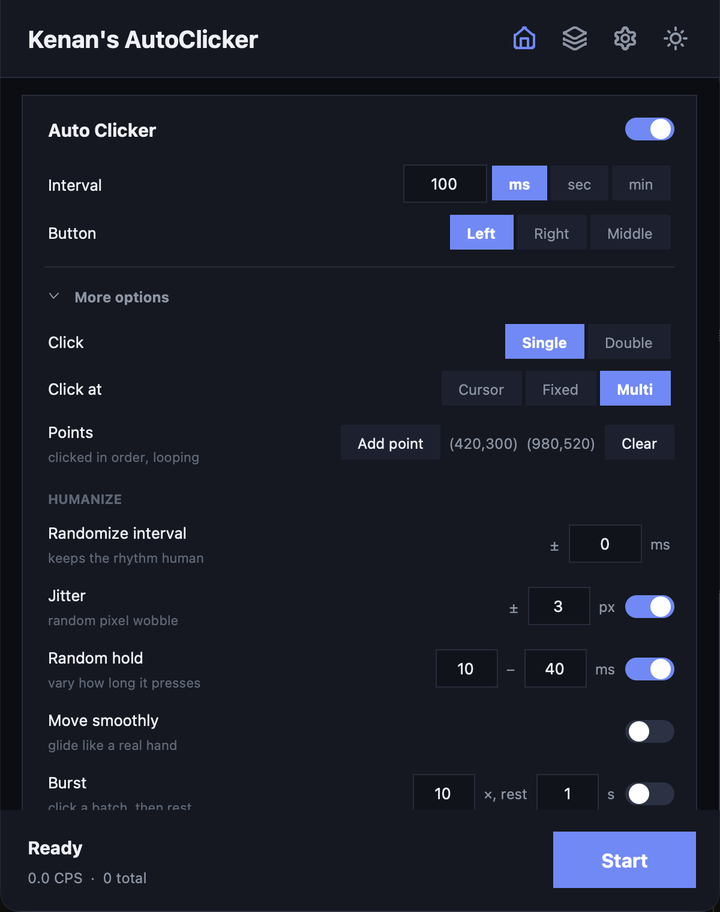
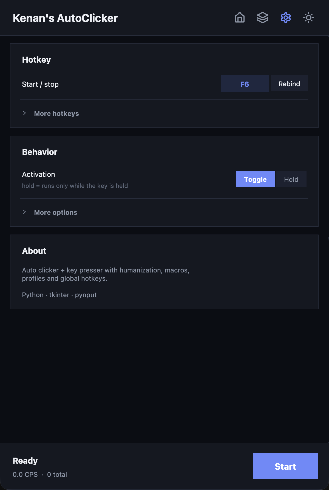
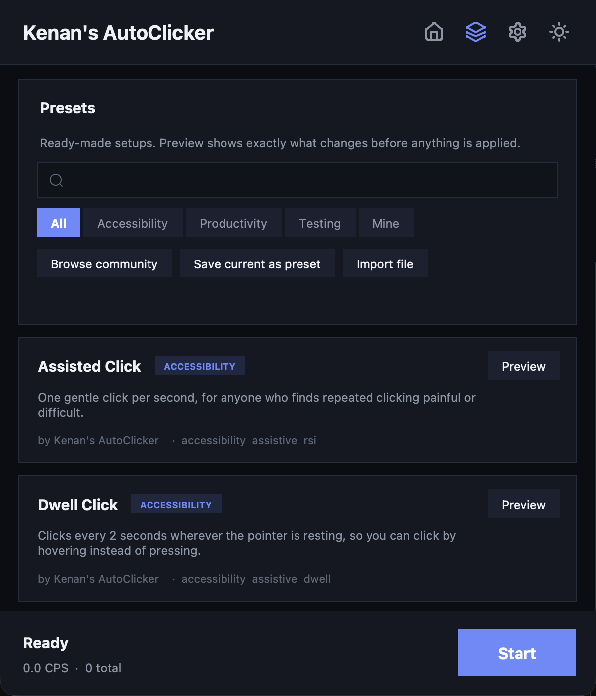
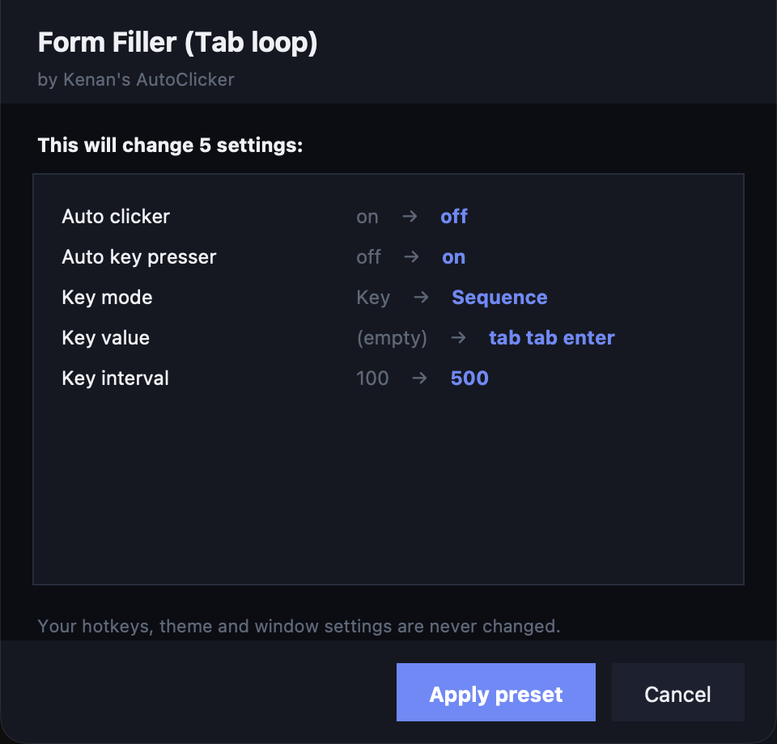
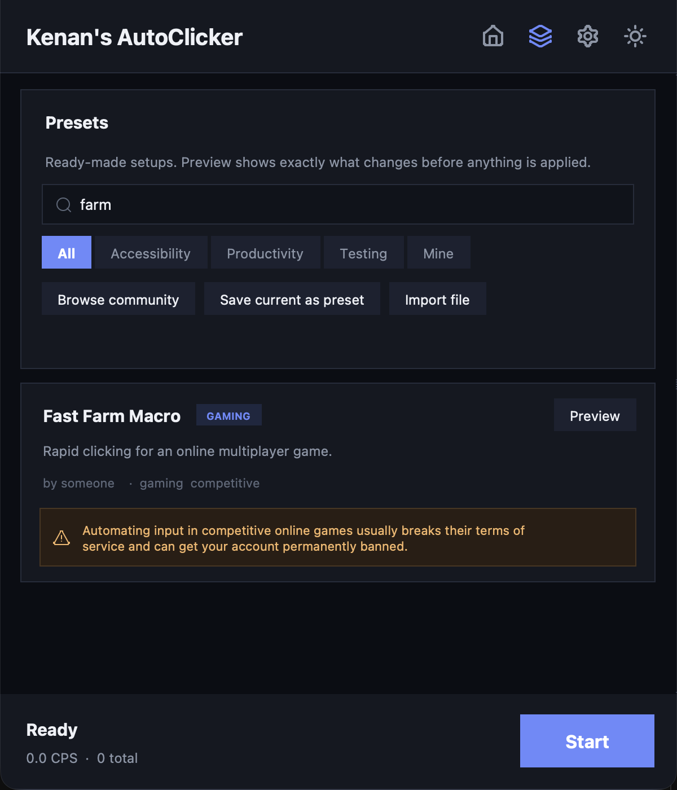

<div align="center">



**KAC** is an open-source input automation tool for accessibility, repetitive
work, and software testing.

Set it up once. Save it as a preset. Share it with everyone else.

[](https://github.com/KenanSab/KenansAutoClicker/actions)
[](tests/)
[](LICENSE)
[](https://python.org)
[](#download)

[**Download**](#download) · [**Presets**](#presets) · [**Features**](#features) · [**Design notes**](DESIGN.md) · [**Contributing**](CONTRIBUTING.md)

</div>

---

## Why this exists

Repetitive input is a genuine accessibility barrier. People with RSI, tremors, or
limited hand mobility struggle with interfaces that assume fast, repeated
clicking. The same mechanism solves ordinary problems too: stepping through
hundreds of data-entry rows, or stress-testing a button in QA.

Most auto clickers are closed-source binaries of unclear provenance that ask you
to trust them. This one is **readable, tested, and shareable**: every setup can
be saved as a preset, and every preset shows you exactly what it will change
before it changes anything.

---

## Screenshots

<table>
<tr>
<td width="50%"></td>
<td width="50%"></td>
</tr>
<tr>
<td align="center"><em>Four controls. That's the whole default view.</em></td>
<td align="center"><em>Light theme, one click away.</em></td>
</tr>
</table>

The interface stays out of your way. Interval, button, key, and go — everything
else lives behind **More options** until you ask for it.

<table>
<tr>
<td width="50%"></td>
<td width="50%"></td>
</tr>
<tr>
<td align="center"><em>Targeting and humanization, on demand.</em></td>
<td align="center"><em>Settings follow the same rule.</em></td>
</tr>
</table>

---

## Download

Windows `.exe` and macOS builds are produced automatically by GitHub Actions,
and only after the test suite passes.

**[→ Get the latest release](../../releases)**

| Platform | File |
|---|---|
| Windows | `KenansAutoClicker.exe` |
| macOS | `KenansAutoClicker-macOS.zip` |

No release yet? Open the **Actions** tab → newest run → **Artifacts**.

> **Windows shows "Windows protected your PC"** for any new unsigned app.
> Click **More info → Run anyway**. Code-signing certificates cost hundreds of
> dollars a year, which isn't practical for a free tool.
>
> **macOS** — right-click → **Open** the first time, then allow the app under
> *System Settings → Privacy & Security → Accessibility* so it can send input.

---

## Presets

The feature that makes this more than another auto clicker.

A **preset** is a complete setup (interval, button, key, humanization) packaged
so someone else can use it in one click.

<table>
<tr>
<td width="55%"></td>
<td width="45%"></td>
</tr>
<tr>
<td align="center"><em>Search and filter the library.</em></td>
<td align="center"><em>See every change before it happens.</em></td>
</tr>
</table>

### Built in

| Category | Presets |
|---|---|
| **Accessibility** | Assisted Click · Dwell Click · Key Repeat Assist |
| **Productivity** | Form Filler · Keep Screen Awake · Bulk Confirm |
| **Testing** | UI Stress Test · Repeatable QA Run · Human-like Clicking |

### From the community

Press **Browse community** to load presets other people have contributed. Your
username appears on your preset's card, so contributors get credit too.

**Share yours:** *Save current as preset* → open a pull request.
See **[CONTRIBUTING.md](CONTRIBUTING.md)**.

### Presets are safe by construction

This matters, because a preset can come from the internet.

- **Allow-listed.** A preset may only change *how clicking and typing behave*.
  It cannot touch your hotkeys, theme, window settings, or statistics — anything
  else is stripped out during validation.
- **Never executed.** A preset is data, not code. Nothing in it is ever run.
- **Offline by default.** The app makes no network request until you press
  *Browse community*. Not on startup, not ever otherwise.
- **Previewed first.** You see the exact diff, old value to new value, and
  choose whether to apply it.

There are [tests](tests/test_presets.py) asserting each of these, including one
that feeds the validator a hostile preset trying to rebind hotkeys.

### A note on games

Presets for games are welcome, but be aware:

> **Automating input in competitive online games usually breaks their terms of
> service and can get your account permanently banned.**

Presets tagged `competitive` display that warning on their card:

<div align="center">

</div>

Single-player, idle and AFK presets don't need the tag.

---

## Features

**Auto clicker.** Left, right or middle button, single or double, intervals from
milliseconds to minutes. Click at the cursor, at a fixed point, or cycle through
a sequence of points you pick on screen.

**Auto key presser.** A single key, a sequence (`q w e r`), a combo
(`ctrl+shift+a`), or repeatedly typed text.

**Humanization.** Jitter, randomized intervals, variable hold time, smooth
eased movement, and burst mode, so the input isn't a dead metronome.

**Control.** Global **F6** start/stop and **F9** panic stop that work even when
the window isn't focused, both rebindable. Toggle or hold-to-run. Auto-stop after
a number of actions or seconds, with an optional countdown.

**Quality of life.** Live CPS counter, all-time stats, save/load profiles,
always-on-top, light and dark themes.

---

## Run from source

```bash
git clone https://github.com/KenanSab/KenansAutoClicker.git
cd KenansAutoClicker
pip install -r requirements.txt
python KenansAutoClicker.py
```

## Build it yourself

```bash
pip install pyinstaller
pyinstaller --onefile --windowed --name "KenansAutoClicker" KenansAutoClicker.py
```

## Tests

```bash
pip install pytest
python -m pytest tests/ -q
```

**85 tests** covering preset validation and hostile input, the input engine, key
parsing, persistence, and interface behavior. CI runs them on every push, and
nothing is built unless they pass.

## Shipping a change

```bash
./ship.sh "what changed"                 # test, commit, push
./ship.sh "what changed" --release 2.1.0 # ...and cut a versioned release
./ship.sh --dry                          # just run the tests
```

The script refuses to commit or push if the tests fail. Once pushed, GitHub
builds both platforms and refreshes the rolling **latest** download on its own.
Tagging is only needed for a permanent versioned release.

---

## How it's built

Python, tkinter and [pynput](https://pypi.org/project/pynput/). One dependency.

```
kenansautoclicker/
├── app.py           window, state, hotkeys, start/stop wiring
├── engine.py        timing, humanization, the click/key loops
├── presets.py       preset model, validation, community fetching
├── ui_base.py       cards, rows, scrolling, theming
├── ui_home.py       Home page
├── ui_presets.py    Presets page
├── ui_settings.py   Settings page
├── widgets.py       switches, segmented pickers, disclosures, icon buttons
├── icons.py         Lucide icons + an SVG path renderer
├── keys.py          key naming, serialization, sequence/combo parsing
├── storage.py       config and profile persistence
└── theme.py         color palettes
```

### Two decisions worth explaining

**Icons are drawn, not bundled.** There's no image library here. `icons.py`
contains a small SVG path renderer (cubic-bézier and elliptical-arc flattening)
that draws [Lucide](https://lucide.dev)'s real path data straight onto a canvas.
The icons stay crisp at any size, follow the theme automatically, and the
dependency list stays at exactly one package.

**Presets are validated, not trusted.** Community presets arrive as JSON from
the internet, so `clean_preset()` treats every field as hostile: keys are
allow-listed, strings are length-capped, and nothing is ever evaluated. The
worst a malicious preset can do is change your click interval.

---

## Contributing

Presets are the easiest and most useful contribution — see
**[CONTRIBUTING.md](CONTRIBUTING.md)** for the format and the PR flow.

Bug reports and code are welcome too. If you're fixing a bug, a test that fails
before your fix is the most valuable thing you can include.

---

## Credits

Created by **Kenan** — [github.com/KenanSab](https://github.com/KenanSab)

Icons by [Lucide](https://lucide.dev) (ISC License).

Licensed under the [MIT License](LICENSE): free to use, modify, and share,
including commercially, as long as the copyright notice is kept.

<div align="center">

*Use responsibly, and only where automated input is permitted.*

</div>
